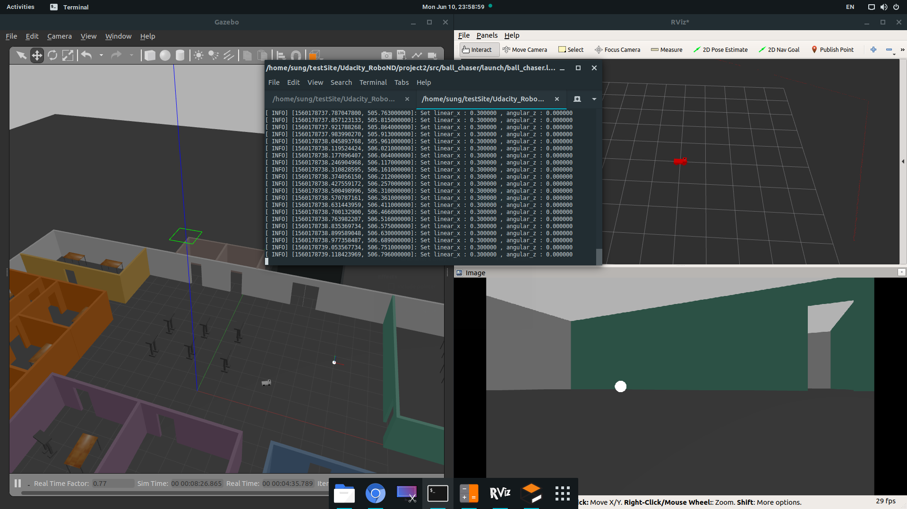

## Project 2. Go Chase It!

### Project Aspect
- `drive_bot`
   - Create a `my_robot` ROS package
   - Design a differential drive robot with the Unified Robot Description Format
   - Add two sensors to my robot : `Camera`, `LIDAR`
- `world`
   - Add a white-colored ball to my gazebo world (whichi is created in project 1)
- `ball_chaser`
   - Create a ball_chaser ROS package
   - Create `ball_chaser/command_robot` service to drive the robot by controlling its linear x and angular z velocities
   - Write a `process_image` C++ node that reads my robot’s camera image
      - And analyzes it to determine the presence and position of a white ball.
      - If a white ball exists in the image, your node should request a service via a client to drive the robot towards it.


### Directory Structure
```
    .Project2                          # Go Chase It Project
    ├── my_robot                       # my_robot package                   
    │   ├── launch                     # launch folder for launch files   
    │   │   ├── robot_description.launch
    │   │   ├── world.launch
    │   ├── meshes                     # meshes folder for sensors
    │   │   ├── hokuyo.dae
    │   ├── urdf                       # urdf folder for xarco files
    │   │   ├── my_robot.gazebo        # my robot model
    │   │   ├── my_robot.xacro         # my robot model
    │   │   ├── my_robot(original).gazebo
    │   │   ├── my_robot(original).xacro
    │   ├── world                      # world folder for world files
    │   │   ├── <yourworld>.world
    │   ├── CMakeLists.txt             # compiler instructions
    │   ├── package.xml                # package info
    ├── ball_chaser                    # ball_chaser package                   
    │   ├── launch                     # launch folder for launch files   
    │   │   ├── ball_chaser.launch
    │   ├── src                        # source folder for C++ scripts
    │   │   ├── drive_bot.cpp
    │   │   ├── process_images.cpp
    │   ├── srv                        # service folder for ROS services
    │   │   ├── DriveToTarget.srv
    │   ├── CMakeLists.txt             # compiler instructions
    │   ├── package.xml                # package info                  
    └── my ball                        # my ball gazebo model      
```

### Steps to launch the simulation
#### Step 1 Update and upgrade the Workspace image
```sh
$ sudo apt-get update
$ sudo apt-get upgrade -y
```

#### Step 2 Clone the lab folder in /home/workspace/
```sh
$ cd /home/workspace/
$ git clone https://github.com/samchiRobot/Udacity_RoboticsEngineer/
```

#### Step 3 Compile the code by catkin
```sh
$ cd /home/workspace/project2/
$ catkin_make
```

#### Step 4 Launch the robot inside my world
```sh
$ cd /home/workspace/project2/
$ source devel/setup.bash
$ roslaunch my_robot world.launch
```

#### Step 5 Run the `drive_bot` and `process_image` node

Open new terminal

```sh
$ cd /home/workspace/project2/
$ source devel/setup.bash
$ roslaunch ball_chaser ball_chaser.launch
```
#### Step 6 Visualize camera images 

Open new terminal

```sh
$ cd /home/workspace/project2/
$ source devel/setup.bash
$ rosrun rqt_image_view rqt_image_view  
```


### Output
My program should both launch as follow

